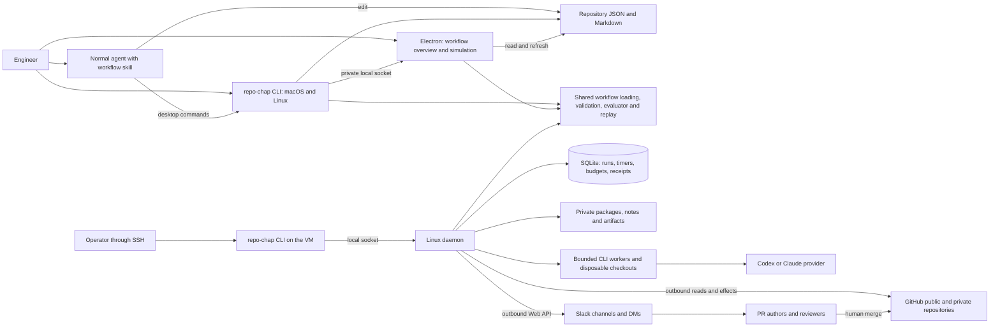
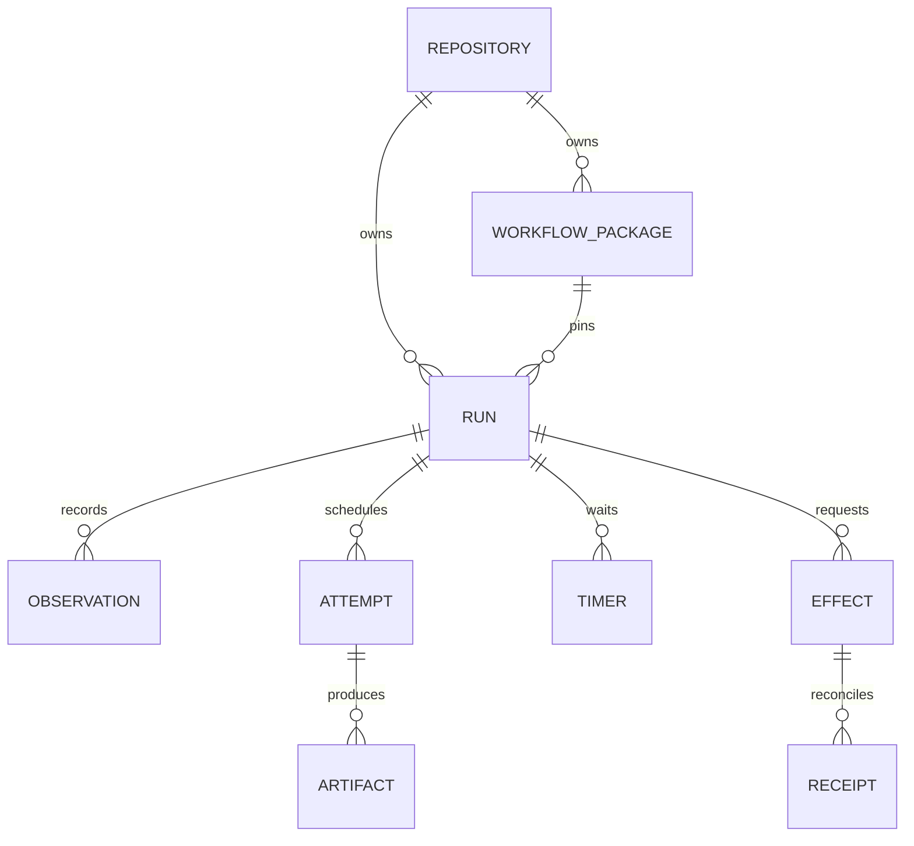
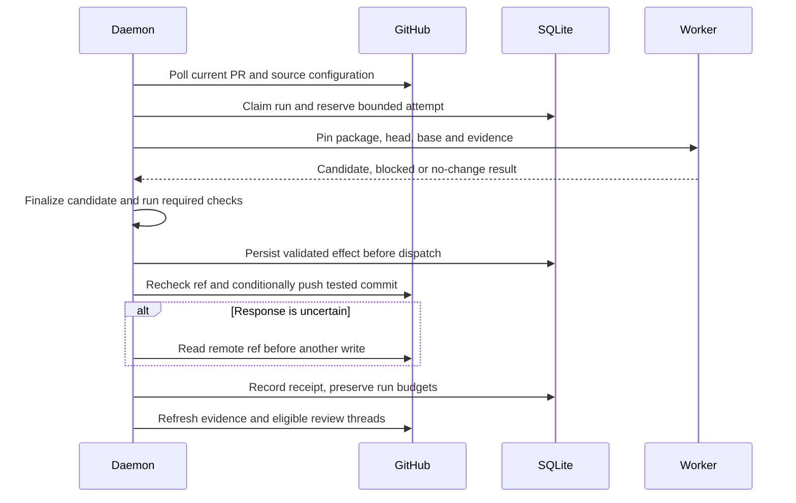
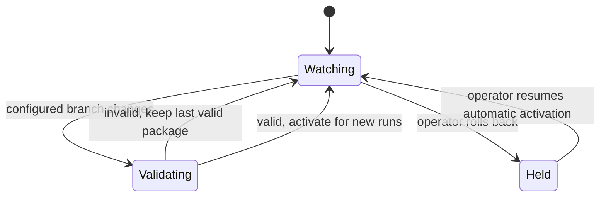

# Repo Chap architecture

The CLI, Electron companion, and private daemon share workflow validation and
execution contracts. Repository files remain the authoring format.

## Applications and external systems

The daemon requires outbound connectivity and has no public listener. Its CLI
control socket is local to the VM. The Electron application does not connect
to the daemon. Slack has no interactive callback in v1.

## Code organization

| Directory | Responsibility |
| --- | --- |
| apps/cli | Local commands, inspection, replay, apply, and daemon controls |
| apps/desktop | File refresh, workflow overview, simulation, Slack preview and guidance |
| packages/companion | Desktop control protocol and private local socket |
| skills/repo-chap-workflows | Globally installable agent authoring instructions and starter |
| apps/daemon | Linux entry point, polling, durable scheduling and local controls |
| packages/workflow | File loading, schemas, immutable packages, evaluator, replay |
| packages/github | Authentication, paginated observations and named GitHub effects |
| packages/providers | Codex and Claude subprocess adapters and validated results |
| packages/execution | Local checkout lifecycle, candidate preparation and checks |
| packages/runtime | SQLite runs, timers, leases, budgets and effect receipts |
| packages/slack | Identity mapping, rendering, delivery and message receipts |

CLI and desktop use the shared evaluator. The companion package defines local
commands and their transport; it does not depend on Electron or provider adapters.

## Persisted data

Runs have independent IDs. A run records a subject kind and subject ID; only
pull requests are executable subjects in v1. Keep PR facts outside general
attempt and effect identity. Later repository jobs can reuse those records.
Store immutable large files outside SQLite and commit references after bytes
exist. state.json is a revisioned export, never a second writable control store.

## An attempt

A process owns remote effects so failed delivery never forces a new repair.
The worker and tests are trusted processes with bounded lifetimes; v1 does not
require containers, microVMs, or hostile-code isolation.

## Configuration recovery

Each running PR keeps its pinned package. Explicit migration happens at a
checkpoint and preserves receipts, suppression, and budgets. Markdown references
resolve from the same commit as JSON. Runtime writes stay outside the repository,
so a result export cannot create a new commit and trigger another review.

## Resilience and scaling after v1

The one VM is an accepted v1 failure point and throughput limit. Restart recovery
and backups do not make it highly available. Keep the following requirements in
v1 so later distribution does not require changing workflow definitions:

- Keep evaluation independent of SQLite, filesystem paths, process launching,
  and a long-lived server. Supply observations, configuration, and time as data.
- Dispatch versioned, serializable job inputs and results. Include run/attempt
  identity, pinned input digests, deadline, and ownership token. Local processes
  implement the only transport in v1; do not add a queue service yet.
- Reference artifacts by logical ID and digest. A storage module resolves those
  references to private local files today, with object storage possible later.
  A saved worker directory or conversation is a cache, never required for recovery.
- Keep atomic claim, budget reservation, completion, and outbox operations in the
  runtime storage module. Do not expose SQLite connections to the evaluator or
  provider adapters. A future shared database must preserve those transactions.
- Make ownership and effect reconciliation explicit. Lost ownership rejects late
  results. Duplicate jobs cannot reset budgets or duplicate logical effects.
  A future remote worker must not perform a write merely because it once had a
  lease. Remote preconditions and durable receipt reconciliation remain required.

The first scaling change can move workers to additional VMs or Kubernetes while
retaining one scheduler. Removing scheduler failover risk also requires a shared
transactional store, shared artifact access, coordinated claims, and tested
recovery. A network filesystem containing SQLite is not that design.

Cloudflare Workers or AWS/Azure functions are possible future orchestration
hosts, subject to provider/runtime and credential testing. They are not promised
as interchangeable hosts for native Git and CLI subprocesses. Cloudflare's
[Node compatibility documentation](https://developers.cloudflare.com/workers/runtime-apis/nodejs/)
currently lists child_process as a non-functional stub. AWS recommends committing
permanent state to durable services rather than relying on invocation-local state
in [Lambda application design](https://docs.aws.amazon.com/lambda/latest/dg/concepts-application-design.html).
These sources were checked on 2026-09-16. Repo Chap's future deployment would
choose compatible execution workers and storage, rather than moving the current
single-process daemon unchanged.

Later refinement must select recovery-time/data-loss objectives, throughput,
platform, shared storage, credential delivery, and rolling-upgrade behavior before
promising high availability. V1 implements none of those cloud adapters or a
multi-host scheduler.

## Desktop agent collaboration

The agent owns its editing session in the managed repository. The workflow skill
ships with the CLI and installs into the user's global skills directory. It
uses ordinary files, shared validation/replay, and `repo-chap desktop` commands.

Electron's main process owns a read-only repository session. A serialized queue
handles commands and file refresh, and shared loading pins consistent JSON and
references. The renderer receives typed snapshots and renders plain text.
It has no filesystem access, provider process, or editing operation.

The companion socket lives in a user-owned mode-0700 directory outside Git.
It accepts versioned commands with repository and optional workflow checks.
Targets identify visible sections, rules, and actions. Annotation text is inert,
expires automatically, and can be dismissed. No public listener is introduced.

Simulation retains the tested package and input digests. Refresh marks prior
results stale when files change or become unreadable. Test and captured-PR inputs
remain separate. Captures validate their paired evidence and fixture digests,
while existing analysis callers still require the original workflow digest.
Replaying new workflow logic against an older observation makes no live request.

The last repository/workflow selection is saved in private app data. Restart
reloads files from disk, not an unsaved editor buffer. The app neither activates
daemon workflows nor changes remote permissions or run budgets.
