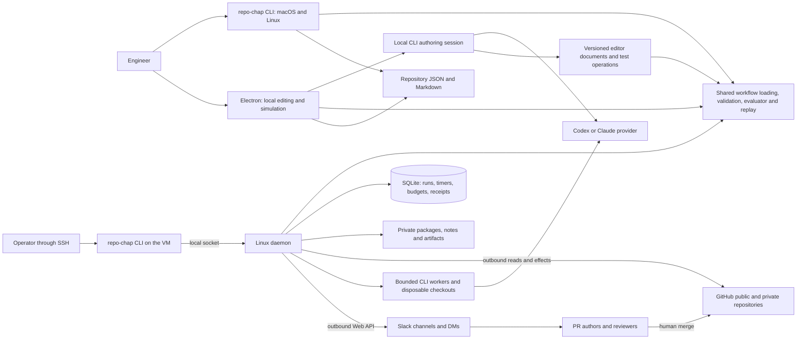
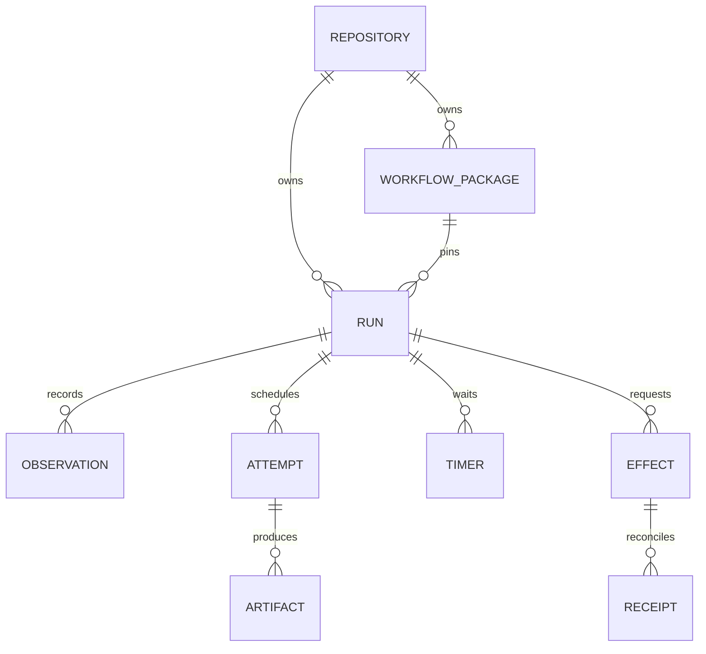
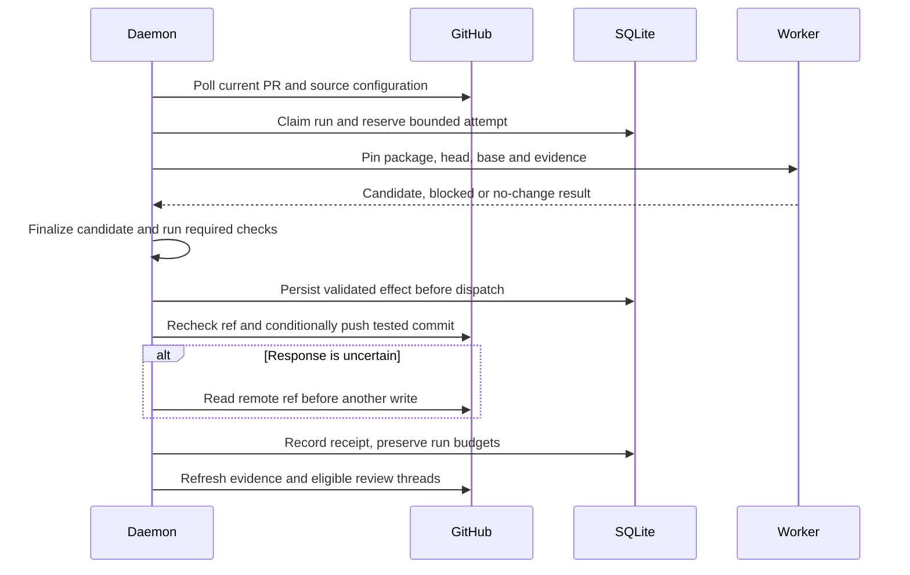
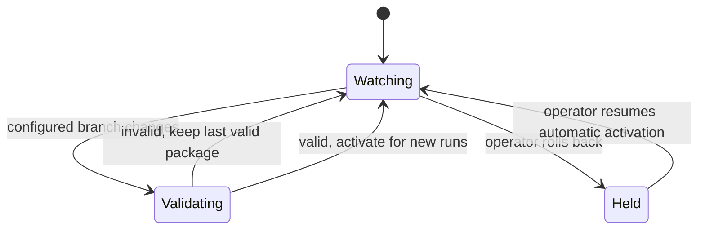

# Repo Chap architecture

Status: proposed implementation. The existing runnable artifact is an offline
presentation, not the CLI, Electron app, or daemon.

## Applications and external systems

The daemon requires outbound connectivity and has no public listener. Its CLI
control socket is local to the VM. The Electron application does not connect
to the daemon. Slack has no interactive callback in v1.

## Code organization

| Proposed directory | Responsibility |
| --- | --- |
| apps/cli | Local commands, inspection, replay, apply, and daemon controls |
| apps/desktop | Electron file editing, rule view, simulation and Slack preview |
| apps/daemon | Linux entry point, polling, durable scheduling and local controls |
| packages/workflow | File loading, schemas, immutable packages, evaluator, replay |
| packages/github | Authentication, paginated observations and named GitHub effects |
| packages/providers | Codex and Claude subprocess adapters and validated results |
| packages/execution | Local checkout lifecycle, candidate preparation and checks |
| packages/runtime | SQLite runs, timers, leases, budgets and effect receipts |
| packages/slack | Identity mapping, rendering, delivery and message receipts |

These are proposed implementation locations, not implemented modules. Keep
related code together and avoid an interface per internal class. CLI and desktop
must use the shared evaluator instead of maintaining their own rule engines.

## Persisted data

Runs have independent IDs. A run records a subject kind and subject ID; only
pull requests are executable subjects in v1. Keep PR facts outside general
attempt and effect identity. Later repository jobs can reuse those records.
Store immutable large files outside SQLite and commit references after bytes
exist. state.json is a revisioned export, never a second writable control store.

## An attempt

A process owns remote effects so failed delivery never forces a new repair.
The worker and tests are trusted processes with bounded lifetimes; v1 does not
require containers, microVMs, or hostile-code isolation.

## Configuration recovery

Each running PR keeps its pinned package. Explicit migration happens at a
checkpoint and preserves receipts, suppression, and budgets. Markdown references
resolve from the same commit as JSON. Runtime writes stay outside the repository,
so a result export cannot create a new commit and trigger another review.

## Resilience and scaling after v1

The one VM is an accepted v1 failure point and throughput limit. Restart recovery
and backups do not make it highly available. Keep the following requirements in
v1 so later distribution does not require changing workflow definitions:

- Keep evaluation independent of SQLite, filesystem paths, process launching,
  and a long-lived server. Supply observations, configuration, and time as data.
- Dispatch versioned, serializable job inputs and results. Include run/attempt
  identity, pinned input digests, deadline, and ownership token. Local processes
  implement the only transport in v1; do not add a queue service yet.
- Reference artifacts by logical ID and digest. A storage module resolves those
  references to private local files today, with object storage possible later.
  A saved worker directory or conversation is a cache, never required for recovery.
- Keep atomic claim, budget reservation, completion, and outbox operations in the
  runtime storage module. Do not expose SQLite connections to the evaluator or
  provider adapters. A future shared database must preserve those transactions.
- Make ownership and effect reconciliation explicit. Lost ownership rejects late
  results. Duplicate jobs cannot reset budgets or duplicate logical effects.
  A future remote worker must not perform a write merely because it once had a
  lease. Remote preconditions and durable receipt reconciliation remain required.

The first scaling change can move workers to additional VMs or Kubernetes while
retaining one scheduler. Removing scheduler failover risk also requires a shared
transactional store, shared artifact access, coordinated claims, and tested
recovery. A network filesystem containing SQLite is not that design.

Cloudflare Workers or AWS/Azure functions are possible future orchestration
hosts, subject to provider/runtime and credential testing. They are not promised
as interchangeable hosts for native Git and CLI subprocesses. Cloudflare's
[Node compatibility documentation](https://developers.cloudflare.com/workers/runtime-apis/nodejs/)
currently lists child_process as a non-functional stub. AWS recommends committing
permanent state to durable services rather than relying on invocation-local state
in [Lambda application design](https://docs.aws.amazon.com/lambda/latest/dg/concepts-application-design.html).
These sources were checked on 2026-09-16. Repo Chap's future deployment would
choose compatible execution workers and storage, rather than moving the current
single-process daemon unchanged.

Later refinement must select recovery-time/data-loss objectives, throughput,
platform, shared storage, credential delivery, and rolling-upgrade behavior before
promising high availability. V1 implements none of those cloud adapters or a
multi-host scheduler.

## Desktop agent collaboration

Electron owns local conversation processes outside the renderer. The renderer
receives bounded streamed events through typed IPC and shares one revisioned
workflow/Markdown/fixture model with the source editor, visual editor and agent
operations. Operations return actual validation and simulation results.

An agent mutation carries the expected document revision. Reject a stale update
and return current context so it can propose a new edit; never overwrite newer
human work. Apply valid operations visibly, group undo per agent operation, and
keep changes staged until save. Cancellation stops the process and pending tools
without pretending previously applied edits were undone. A conversation stores
bounded context privately and can restart without losing staged documents.

Simulation takes a pinned draft and fixture revision, so editing while a test
runs does not mislabel its result as current. It requires no network even when
a provider-backed chat session is open. No daemon connection is introduced.
